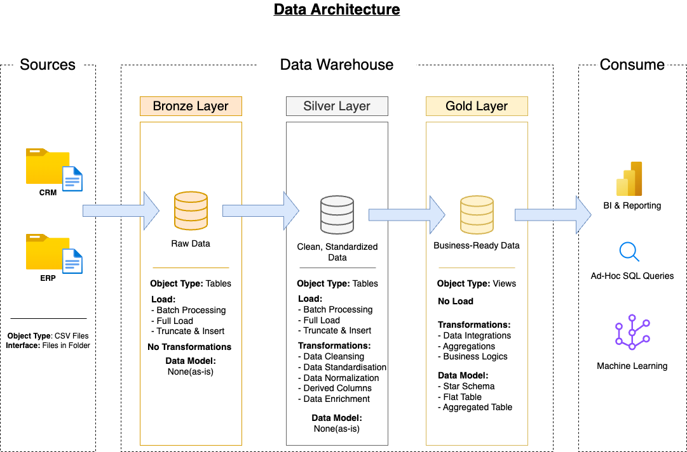

## Data Warehouse & Analytics Project

This project demonstrates the end-to-end lifecycle of building a modern data warehouse and running advanced analytics on business data using **SQL Server (T-SQL)**. From ingesting raw datasets to designing a star schema and generating deep analytical insights — the project walks through real-world BI processes step by step.

### Why this project?

In today’s data-driven world, organizations rely on clean and structured data to make decisions. This project simulates a realistic data pipeline to:

- design a layered architecture using the Medallion approach (bronze, silver, gold)
- implement ETL pipelines to process CRM (Customer Relationship Management) and ERP (Enterprise Resource Planning) data
- run exploratory and advanced SQL analysis for insights

### Real-world context

A mid-sized company is trying to merge data from sales and customer systems to analyze:

- sales performance over time  
- customer behavior and segmentation  
- product-level revenue and profitability  
- key KPIs like recency, quantity sold, and AOV  

This project delivers those insights using SQL-powered data engineering and analytics.
---
## 🏗️ Data Architecture

The data architecture for this project follows Medallion Architecture **Bronze**, **Silver**, and **Gold** layers:


1. **Bronze Layer**: Stores raw data as-is from the source systems. Data is ingested from CSV Files into SQL Server Database.
2. **Silver Layer**: This layer includes data cleansing, standardization, and normalization processes to prepare data for analysis.
3. **Gold Layer**: Houses business-ready data modeled into a star schema required for reporting and analytics.

---
## 📖 Project Overview

This project involves:

1. **Data Architecture**: Designing a Modern Data Warehouse Using Medallion Architecture **Bronze**, **Silver**, and **Gold** layers.
2. **ETL Pipelines**: Extracting, transforming, and loading data from source systems into the warehouse.
3. **Data Modeling**: Developing fact and dimension tables optimized for analytical queries.
4. **Analytics & Reporting**: Creating SQL-based reports and dashboards for actionable insights.

---

## 🚀 Project Requirements

### Building the Data Warehouse (Data Engineering)

#### Objective
Develop a modern data warehouse using SQL Server to consolidate sales data, enabling analytical reporting and informed decision-making.

#### Specifications
- **Data Sources**: Import data from two source systems (ERP and CRM) provided as CSV files.
- **Data Quality**: Cleanse and resolve data quality issues prior to analysis.
- **Integration**: Combine both sources into a single, user-friendly data model designed for analytical queries.
- **Scope**: Focus on the latest dataset only; historization of data is not required.
- **Documentation**: Provide clear documentation of the data model to support both business stakeholders and analytics teams.

---

### BI: Analytics & Reporting (Data Analysis)

#### Objective
Develop SQL-based analytics to deliver detailed insights into:
- **Customer Behavior**
- **Product Performance**
- **Sales Trends**

These insights empower stakeholders with key business metrics, enabling strategic decision-making.  

## 📂 Repository Structure
```
data-warehouse-project/
│
├── datasets/                           # Raw datasets used for the project (ERP and CRM data)
│
├── docs/                               # Project documentation and architecture diagrams
│   ├── Data_Architecture.drawio        # Medallion architecture (Bronze, Silver, Gold)
│   ├── Data_Architecture.drawio.png
│   ├── Data Flow Diagram.drawio        # Full ETL/data movement pipeline
│   ├── Data Flow Diagram.drawio.png
│   ├── Integration Model.drawio        # How ERP & CRM data are merged and structured
│   ├── Integration Model.drawio.png
│   ├── Star Schema (Data Mart).drawio  # Final analytical data model for reporting
│   ├── Data Catalog.md                 # Describes tables, fields, types, and business meaning
│   ├── Naming Convention.md            # Consistent naming standards across tables and files
│
├── scripts/                            # SQL scripts for ETL and data modeling
│   ├── bronze/                         # Load raw ERP & CRM data into staging tables
│   ├── silver/                         # Clean, normalize, and join datasets for unified structure
│   ├── gold/                           # Build final fact and dimension tables (star schema)
│
├── tests/                              # Data quality checks (nulls, duplicates, referential integrity)
│
├── Analytics-script/                   # SQL scripts for business analysis and insights
│   ├── 1. EDA-analysis/                # Exploratory Data Analysis to understand structure and stats
│   │   ├── 0_Dimensions & Measures     # Quick scan of key fields like sales amount
│   │   ├── 1_Dimensions Exploration    # Explore countries, product hierarchy, etc.
│   │   ├── 2_Database Exploration      # Explore schema metadata (tables, columns)
│   │   ├── 3_Date Exploration          # Sales timeline and customer age range
│   │   ├── 4_Measures Exploration      # Total sales, quantity, orders, price, customers
│   │   ├── 5_Magnitude Analysis        # Breakdown by category, country, gender, etc.
│   │   ├── 6_Ranking Analysis          # Top/bottom products and customers by revenue
│   │
│   ├── 2. Advanced-analysis/           # Advanced analysis using KPIs, trends, and segmentation
│   │   ├── 1_Change_over_time_analysis # Track sales, customers, and quantity over time
│   │   ├── 2_Cumulative_Analysis       # Running totals and moving averages
│   │   ├── 3_Perfomance_Analysis       # YoY performance and comparison to product average
│   │   ├── 4_Part_to_Whole_Analysis    # % contribution of each category to total sales
│   │   ├── 5_Data_Segmentation         # Segments customers (VIP/Regular/New) and products by cost
│   │   ├── 6_Customer_Report           # Final view with detailed customer-level KPIs
│   │   ├── 7_Product_Report            # Final view with detailed product-level KPIs
│
├── README.md                           # Project overview, architecture, and instructions
└── LICENSE                             # License information (MIT)
```
---

## 🛡️ License

This project is licensed under the [MIT License](LICENSE). You are free to use, modify, and share this project with proper attribution.

## 🌟 About Me

Hi, I’m **Swapnonil Ghosh**, a final-year ECE undergraduate at NIT Agartala with a passion for tech and problem-solving, currently exploring data analytics.
Always eager to learn, build, and turn data into decisions.

Let's stay in touch! Feel free to connect with me on the following platforms:

[](https://www.linkedin.com/in/swapnonilg/)
